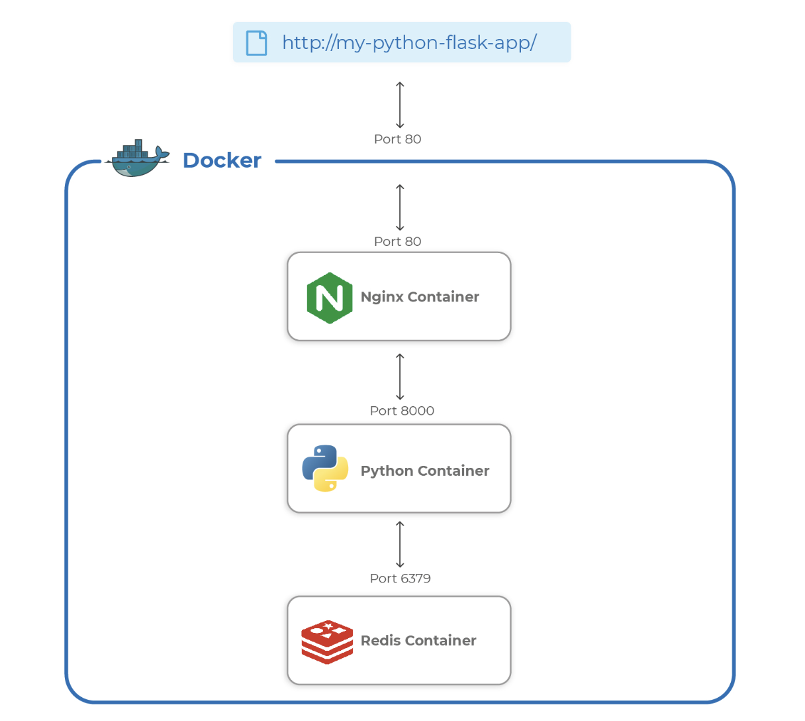

# docker-python-flask

Dockerize Your Flask Python Application

## Overview

This project demonstrates how to Dockerize a Flask application and set it up on an AWS EC2 instance. You can choose to run the application either manually using `docker run` commands or easily with Docker Compose.

## Architectural Diagram

The architectural diagram below illustrates the components and their interactions in this project. 



## Understand the Application

### Flask Application

The Flask application is a Python web application built using the Flask framework. Flask is a lightweight web framework that is easy to set up and scale. It is used here to create a simple web service with a few endpoints.

**Files in the Flask Folder:**

- **`Dockerfile`**: This file contains the instructions to build a Docker image for the Flask application. It sets up the environment, installs dependencies, and defines how to run the Flask application.

- **`main.py`**: This is the main application file where the Flask web server is defined. It includes the routes and logic for handling HTTP requests.

- **`requirements.txt`**: This file lists the Python dependencies required for the Flask application. Docker uses this file to install the necessary packages inside the Docker container.

### Nginx Proxy

Nginx is used as a reverse proxy server to forward requests to the Flask application. It handles incoming HTTP requests and directs them to the Flask application container.

**Files in the Nginx Folder:**

- **`Dockerfile`**: This file contains the instructions to build a Docker image for the Nginx server. It sets up Nginx with the required configuration to serve as a reverse proxy.

- **`conf`**: This folder contains the Nginx configuration files. The primary configuration file, `default.conf`, sets up the proxy rules, such as forwarding requests to the Flask application and handling static files.

### Redis

In this setup, Redis is used solely to keep track of the application hit count. The Redis container is configured to work with the Flask application but does not have any associated files or directories in this project. 


## Setup Instructions

### Create an EC2 Instance on AWS

1. **Select Ubuntu Version:** 24.04 LTS
2. **Amazon Machine Image (AMI):** Ubuntu Server 24.04 LTS (HVM), SSD Volume Type (ami-0e86e20dae9224db8)
3. **Volume Size:** 30 GB (8 GB will also work)
4. **Instance Type:** t2.medium (t2.micro is also acceptable)
5. **Subnet:** Public
6. **SSH Key:** `workshop-docker-python-flask.pem` (Download the key on your machine)
7. **Security Group:** Allow SSH (port 22) and HTTP (port 80) for your IP

### Commands on Your Local Machine

1. **Set Permissions for Your SSH Key:**

    ```bash
    chmod 400 ~/Downloads/workshop-docker-python-flask.pem
    ```

2. **SSH into Your EC2 Instance:**

    ```bash
    ssh -i ~/Downloads/workshop-docker-python-flask.pem ubuntu@<EC2-Public-IP>
    ```

### Setup Docker on the EC2 Instance

1. **Install Docker:**

    - **Update the package index and install prerequisites:**

        ```bash
        sudo apt-get update
        ```

        ```bash
        sudo apt-get install ca-certificates curl
        ```

    - **Add Docker’s GPG key:**

        ```bash
        sudo curl -fsSL https://download.docker.com/linux/ubuntu/gpg | sudo gpg --dearmor -o /usr/share/keyrings/docker-archive-keyring.gpg
        ```

    - **Add Docker’s repository:**

        ```bash
        echo "deb [arch=$(dpkg --print-architecture) signed-by=/usr/share/keyrings/docker-archive-keyring.gpg] https://download.docker.com/linux/ubuntu $(lsb_release -cs) stable" | sudo tee /etc/apt/sources.list.d/docker.list > /dev/null
        ```

    - **Install Docker:**

        ```bash
        sudo apt-get update
        ```

        ```bash
        sudo apt-get install docker-ce docker-ce-cli containerd.io docker-compose-plugin
        ```

    - **Verify Docker Installation:**

        ```bash
        sudo docker run hello-world
        ```

    - **Allow Non-Root User to Run Docker Commands:**

        ```bash
        sudo groupadd docker
        ```

        ```bash
        sudo usermod -aG docker $USER
        ```

        ```bash
        newgrp docker
        ```

2. **Clone the Project Repository:**

    ```bash
    cd /home/ubuntu/
    ```

    ```bash
    git clone https://github.com/shivalkarrahul/docker-python-flask.git
    ```

    ```bash
    cd docker-python-flask/
    ```

### Run the Application Manually

If you prefer to start each container manually, follow these steps:

1. **Start the Redis Container:**

    ```bash
    docker run -d --name redis redis:alpine
    ```

2. **Build and Start the Flask Application Container:**

    ```bash
    docker build -t flask flask/
    ```

    ```bash
    docker run -d --name app --link redis:redis -p 8000:8000 -v app:/app flask
    ```

3. **Build and Start the Nginx Proxy Container:**

    ```bash
    docker build -t nginx nginx/
    ```

    ```bash
    docker run -d --name proxy --link app:app -p 80:80 --restart always nginx
    ```

### Alternative: Using Docker Compose

For a simpler setup, you can use Docker Compose to manage all containers with a single command. Docker Compose can start the containers in the foreground or background, depending on your preference:


- **Start Containers in the Foreground:**

    ```bash
    docker compose up
    ```

    This command will start all containers and keep the terminal open with their logs.

- **Stop Containers running in the Foreground:**

    Press `Ctrl + C` in the terminal where `docker compose up` is running.

- **Start Containers in the Background:**

    If you want to run the containers in the background, add the `-d` flag:

    ```bash
    docker compose up -d
    ```

    This command will start the containers in detached mode, allowing you to continue using the terminal.

- **Stop and Remove Containers:**

    To stop and remove all containers created by Docker Compose, use:

    ```bash
    docker compose down
    ```

    This command will stop and clean up the containers, networks, and volumes defined in the `docker-compose.yml` file.


### Access the Application

- **Restart Containers:**

    As we have stopped the containers, start them again to access the application:

    ```bash
    docker compose up -d
    ```

Once the application containers are running, you can access the application through your web browser:

- **Home Page:** [http://EC2-Public-IP:80/](http://EC2-Public-IP:80/)
- **Hit Endpoint:** [http://EC2-Public-IP:80/hit](http://EC2-Public-IP:80/hit)
- **Reset Endpoint:** [http://EC2-Public-IP:80/hit/reset](http://EC2-Public-IP:80/hit/reset)

Replace `EC2-Public-IP` with your EC2 instance's actual public IP address.


### Cleanup

To stop the application and clean up:

1. **Stop Containers:**

    ```bash
    docker compose down
    ```

2. **Terminate the EC2 Instance:**

    Go to the AWS Management Console and terminate the EC2 instance to avoid incurring additional charges.


Feel free to reach out if you encounter any issues or have questions!    
    
